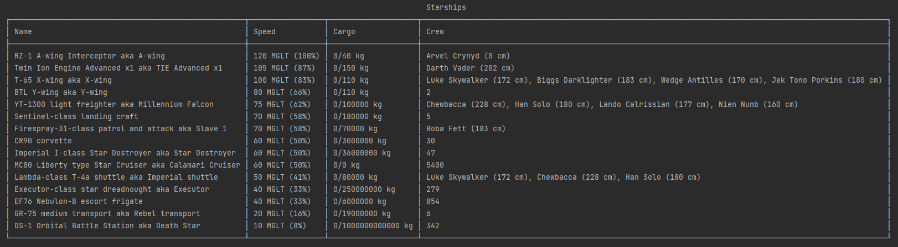

# Starship Management

This is a test assignment from SevenCooks.

````
- use the API https://swapi.dev to fetch data using php 
- display a list/table of 15 starships (name, model, cargo capacity) ordered by fastest (descending).
    - if possible list their pilots as well (name, height) to know the crew better.
    - else it would be nice to know the crew size.
    - each ship in list should show how much slower it is in percent regarding to the fastest one.
- build the ships as own class in PHP
    - the ships should be able to transport different objects as some cargo which can get added by using a method (cargo reduces cargo capacity).
    - the attributes of the ships should be accessible by getters/setters            
- to display the results, you can decide to use html or commandline output.
````

## Expected output

It should look something like this:



## Running locally

1. Clone this repository to your local machine.
2. Install dependencies with ``composer install``.
3. Run the code with ``php index.php``.
